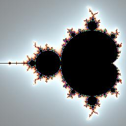

# metalcompute for Python


A python library to run metal compute kernels on macOS >= 11

## Installations

Install latest stable release from PyPI:

```
> python3 -m pip install metalcompute
```

Install latest unstable version from Github:

```
> python3 -m pip install git+https://github.com/baldand/py-metal-compute.git
```

Install locally from source:

```
> python3 -m pip install .
```

## Basic test

Example execution from M1-based Mac running macOS 12:

```
> python3 tests/basic.py
Calculating sin of 1234567 values
Expected value: 0.9805107116699219 Received value: 0.9807852506637573
Metal compute took: 0.0040209293365478516 s
Reference compute took: 0.1068720817565918 s
```

## Interface

```
import metalcompute as mc

devices = mc.get_devices()
# Get list of available Metal devices

dev = mc.Device() 
# Call before use. Will open default Metal device
# or to pick a specific device:
# mc.Device(device_index)

program = """
#include <metal_stdlib>
using namespace metal;

kernel void test(const device float *in [[ buffer(0) ]],
                device float  *out [[ buffer(1) ]],
                uint id [[ thread_position_in_grid ]]) {
    out[id] = sin(in[id]);
}
"""
function_name = "test"

kernel_fn = dev.kernel(program).function(function_name)
# Will raise exception with details if metal kernel has errors

buf_0 = array('f',[1.0,3.14159]) # Any python buffer object
buf_n = dev.buffer(out_size) 
# Allocate metal buffers for input and output (must be compatible with kernel)
# Input buffers can be dev.buffer or python buffers (will be copied)
# Output buffers must be dev.buffer
# Buffer objects support python buffer protocol
# Can be modified or read using e.g. memoryview, numpy.frombuffer

kernel_fn(kernel_call_count, buf_0, ..., buf_n)
# Run the kernel once with supplied input data, 
# filling supplied output data
# Specify number of kernel calls
# Will block until data available

handle = kernel_fn(kernel_call_count, buf_0, ..., buf_n)
# Run the kernel once, 
# Specify number of kernel calls
# Supply all needed buffers
# Will return immediately, before kernel runs, 
# allowing additional kernels to be queued
# Do not modify or read buffers until kernel completed!

del handle
# Block until previously queued kernel has completed

```

## Examples

### Measure TFLOPS of GPU

```
> metalcompute-measure
Using device: Apple M1 (unified memory=True)
Running compute intensive Metal kernel to measure TFLOPS...
Estimated GPU TFLOPS: 2.53236
Running compute intensive Metal kernel to measure data transfer rate...
Data transfer rate: 58.7291 GB/s
```

### Render a 3D image with raymarching

```
# Usage: metalcompute-raymarch [-width <width>] [-height <height>] [-outname <output image file: PNG, JPG>]

> metalcompute-raymarch.py -width 1024 -height 1024 -outname raymarch.jpg
Render took 0.0119569s
```


### Mandelbrot set

```
# Usage: metalcompute-mandelbrot [-width <width>] [-height <height>] [-outname <output image file: PNG, JPG>]

> metalcompute-mandelbrot
Rendering mandelbrot set using Metal compute, res:4096x4096, iters:8192
Render took 0.401446s
Writing image to mandelbrot.png
Image encoding took 1.35182s
```



## Status

This is a preview version. 
